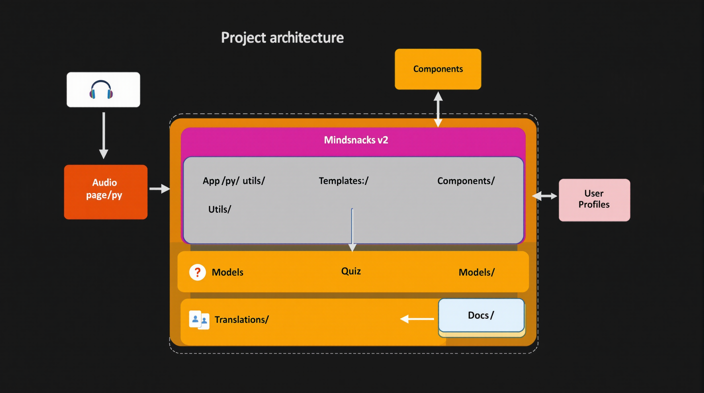

# Mindsnacks v2

**Spotify for Learning**: Customized audio learning snippets for curious minds



## About

Mindsnacks is an advanced audio learning platform that generates customized educational content on any topic. Think of it as "Spotify for Learning" - a platform that provides bite-sized audio learning snippets that you can listen to anytime, anywhere.

## Features

- **Topic Discovery**: Explore trending topics, curated playlists, and follow guided learning paths
- **Content Library**: Manage your learning content with playlists and favorites
- **Audio Learning**: Listen to educational snippets with high-quality TTS generation
- **Quiz Generation**: Test your knowledge with auto-generated quizzes
- **Multi-language Support**: Available in English, French, Spanish, German, Italian, Japanese, Chinese, Arabic, Portuguese, Russian, and Korean
- **Offline Mode**: Download content for offline listening
- **Personalization**: Track your learning progress and get personalized recommendations

## Installation

### Prerequisites

- Python 3.10+
- Node.js 18+
- Access to Groq API (or other LLM provider)

### Setup

1. Clone the repository:
   ```bash
   git clone https://github.com/yourusername/mindsnacks-v2.git
   cd mindsnacks-v2
   ```

2. Create a virtual environment:
   ```bash
   python -m venv venv
   source venv/bin/activate  # On Windows: venv\Scripts\activate
   ```

3. Install dependencies:
   ```bash
   pip install -r requirements.txt
   ```

4. Create a `.env` file with your API keys (see `.env.example` for template)

5. Run the application:
   ```bash
   streamlit run app.py
   ```

## Project Structure

The application follows a modular architecture:

- `app.py`: Main application entry point
- `pages/`: Multi-page Streamlit app structure
- `utils/`: Utility modules for audio, data, LLM, etc.
- `templates/`: Templates for prompts, recommendations, etc.
- `components/`: Reusable UI components
- `models/`: Machine learning models and analytics
- `static/`: Static assets (audio, images, etc.)
- `translations/`: Language translation files

For a detailed structure, see [project_structure.md](project_structure.md).

## API Keys

To use all features, you'll need:

- **Groq API Key**: For LLM content generation
- **ElevenLabs API Key** (optional): For premium voice generation

## Contributing

1. Fork the repository
2. Create a feature branch: `git checkout -b feature-name`
3. Commit your changes: `git commit -m 'Add feature'`
4. Push to the branch: `git push origin feature-name`
5. Submit a pull request

## License

This project is licensed under the MIT License - see LICENSE file for details.

## Acknowledgments

- Streamlit team for the amazing framework
- Groq for the LLM API
- All contributors who have helped improve the project